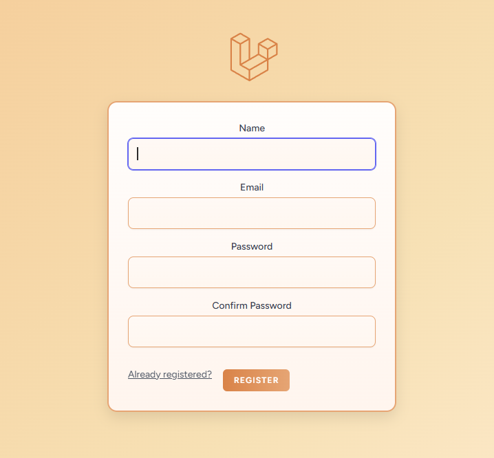
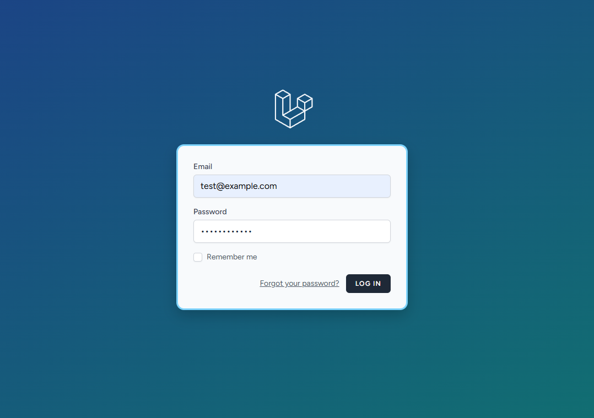
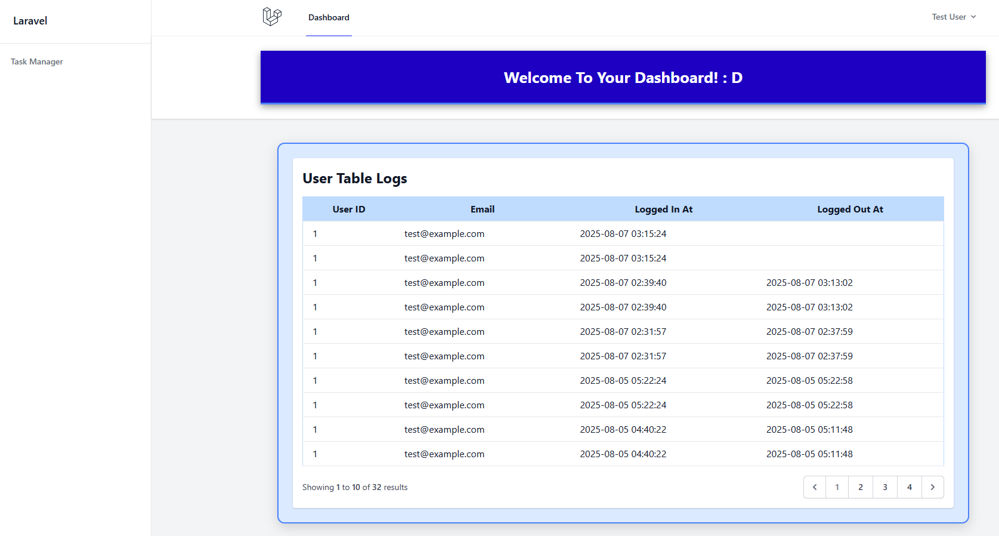
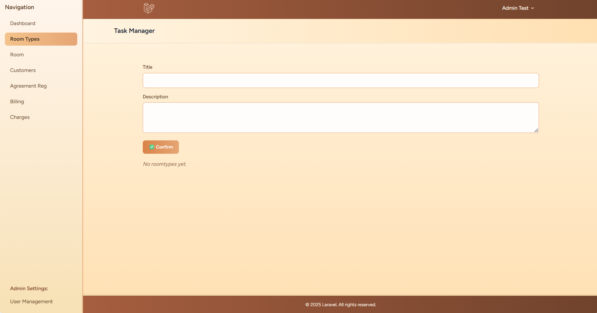
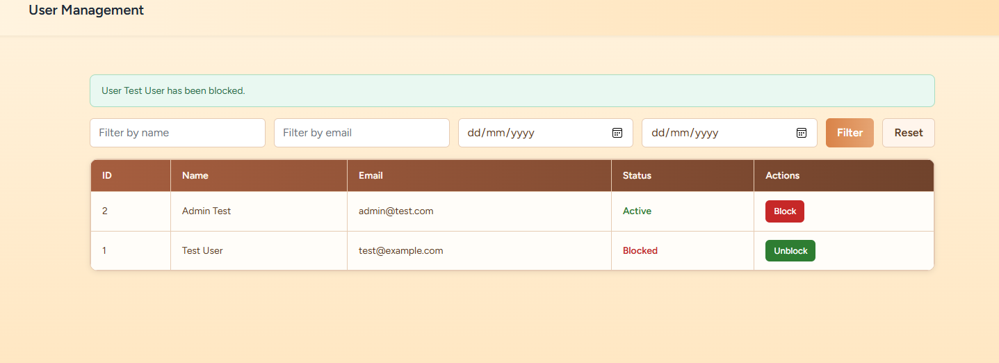
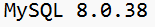

## PROJECT TITLE
* C5 Dormitel Management System

## BACKGROUND OF ORG/BUSINESS

C5 Dormitel is a Dormitory  operational around August 2006 and is located in Davao City along Roxas Avenue. The establishment offers a unique blend of dormitory-style accommodations within a
hotel setting.
It primarily caters to students, professionals, and tourists seeking affordable yet comfortable
lodging. Its history ties to its founding as a budget-friendly alternative to traditional hotels, aiming
to provide accessible, secure, and functional spaces in the city center.

-----
## MODULES

* General
* Room Types Management
* Rooms Management
* Customer Management
* Reservation Management
* Agreement Registration Management
* Billing Management

---

## SETUP

• PHP – Ensure you have PHP 7.3 or later installed.
• Composer – Download and install Composer from https://getcomposer.org.
• Laravel Installer (optional) – Install globally with Composer via:
  composer global require laravel/installer
• Database – Install MySQL (or PostgreSQL, SQLite, etc.) for your app’s database.
• Node.js and npm – Needed for front-end builds (e.g. Tailwind CSS, Vite).
• Git – Useful for version control and cloning repositories.
• Code Editor – VS Code or your preferred editor.

----

• Install dependencies:
  composer install

• Create or update your .env file (if not done already):
  copy .env.example .env
  php artisan key:generate

• Migrate the database (assuming your credentials in .env are set up):
  php artisan migrate

• Install frontend dependencies and build assets (if using Vite/Tailwind):
  npm install
  npm run dev

• Start the Laravel development server:
  php artisan serve

------------------------------

 Clearing Laravel Cache and Optimizing Commands:

  php artisan config:clear
  php artisan route:clear
  php artisan view:clear
  php artisan cache:clear
  php artisan event:clear
  php artisan optimize:clear

------------------------------

Setting up MySQL:

Open your .env file and note your database settings (DB_HOST, DB_DATABASE, DB_USERNAME, DB_PASSWORD).

NOTE: Generating Hashed Passwords in Laravel are stored securely using hashing (bcrypt by default). To generate a hashed password, you can use Laravel's Tinker. Open your terminal in the project folder and run:

    php artisan tinker
    >>> bcrypt('your_plaintext_password')

In your terminal, connect to MySQL using your credentials. For example, if your username is "root":
  mysql -u root -p
Then enter your password when prompted.

Once connected, run:
  SHOW DATABASES;
Confirm that your database (as specified in DB_DATABASE) is listed.

To examine its tables, switch to your database:
  USE your_database_name;
Then list tables:
  SHOW TABLES;

---

## SCREENSHOTS

## Log In Form

## Sign In Form

## Dashboard

## Room Type

## User Management

## Laravel Setup

## Laravel & Vite Version

## Laravel PHP & Composer

## Laravel & Vite

## PHP & Composer

## MySQL

## AUTHOR
DESIREE S. DAGONDON

------

------

## About Laravel 

Laravel is a web application framework with expressive, elegant syntax. We believe development must be an enjoyable and creative experience to be truly fulfilling. Laravel takes the pain out of development by easing common tasks used in many web projects, such as:

- [Simple, fast routing engine](https://laravel.com/docs/routing).
- [Powerful dependency injection container](https://laravel.com/docs/container).
- Multiple back-ends for [session](https://laravel.com/docs/session) and [cache](https://laravel.com/docs/cache) storage.
- Expressive, intuitive [database ORM](https://laravel.com/docs/eloquent).
- Database agnostic [schema migrations](https://laravel.com/docs/migrations).
- [Robust background job processing](https://laravel.com/docs/queues).
- [Real-time event broadcasting](https://laravel.com/docs/broadcasting).

Laravel is accessible, powerful, and provides tools required for large, robust applications.

## Learning Laravel

Laravel has the most extensive and thorough [documentation](https://laravel.com/docs) and video tutorial library of all modern web application frameworks, making it a breeze to get started with the framework.

You may also try the [Laravel Bootcamp](https://bootcamp.laravel.com), where you will be guided through building a modern Laravel application from scratch.

If you don't feel like reading, [Laracasts](https://laracasts.com) can help. Laracasts contains thousands of video tutorials on a range of topics including Laravel, modern PHP, unit testing, and JavaScript. Boost your skills by digging into our comprehensive video library.

## Laravel Sponsors

We would like to extend our thanks to the following sponsors for funding Laravel development. If you are interested in becoming a sponsor, please visit the [Laravel Partners program](https://partners.laravel.com).

### Premium Partners

- **[Vehikl](https://vehikl.com)**
- **[Tighten Co.](https://tighten.co)**
- **[Kirschbaum Development Group](https://kirschbaumdevelopment.com)**
- **[64 Robots](https://64robots.com)**
- **[Curotec](https://www.curotec.com/services/technologies/laravel)**
- **[DevSquad](https://devsquad.com/hire-laravel-developers)**
- **[Redberry](https://redberry.international/laravel-development)**
- **[Active Logic](https://activelogic.com)**

## Contributing

Thank you for considering contributing to the Laravel framework! The contribution guide can be found in the [Laravel documentation](https://laravel.com/docs/contributions).

## Code of Conduct

In order to ensure that the Laravel community is welcoming to all, please review and abide by the [Code of Conduct](https://laravel.com/docs/contributions#code-of-conduct).

## Security Vulnerabilities

If you discover a security vulnerability within Laravel, please send an e-mail to Taylor Otwell via [taylor@laravel.com](mailto:taylor@laravel.com). All security vulnerabilities will be promptly addressed.

## License

The Laravel framework is open-sourced software licensed under the [MIT license](https://opensource.org/licenses/MIT).

