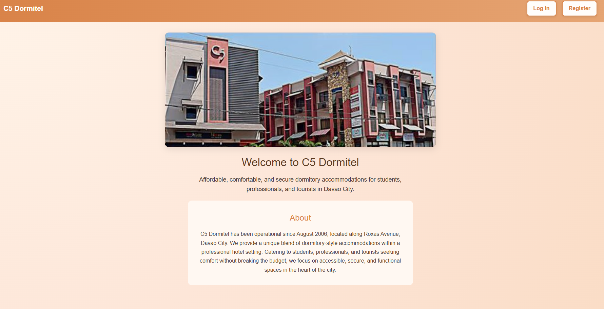
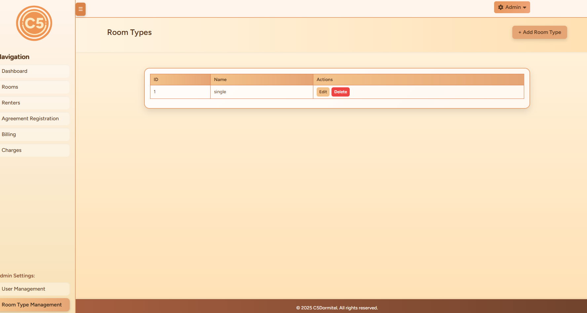

## PROJECT TITLE
## C5 Dormitel Management System

## BACKGROUND OF ORG/BUSINESS

C5 Dormitel is a Dormitory  operational around August 2006 and is located in Davao City along Roxas Avenue. The establishment offers a unique blend of dormitory-style accommodations within hotel setting. 

It primarily caters to students, professionals, and tourists seeking affordable yet comfortable lodging. Its history ties to its founding as a budget-friendly alternative to traditional hotels, aiming
to provide accessible, secure, and functional spaces in the city center.

## Project Description

The C5 Dormitel Management System is a web-based platform developed to streamline and modernize most daily dormitory operations at C5 Dormitel in Davao City. It centralizes key processes such as room types and room management, renter profiles, reservations, agreements, and billing, allowing staff to manage most administrative tasks through a single, organized interface.

The system provides a structured approach to handling dormitory operations, reducing manual effort for administrative work while still requiring in-person actions for certain processes like room inspections and payment collections.

-----

## TECH STACK

- Backend: PHP, Laravel, Composer
- Database: MySQL
- Frontend: Tailwind CSS, Custom/Vanilla CSS & JS, FontAwesome (CDN)
- Build Tool / Environment: Node.js, npm, Vite, Laravel Vite Plugin

## Programming Language: 
- PHP - Handles backend logic, database interactions, and user requests.

## Backend Framework: 
- Laravel - Provides routing, authentication, Eloquent ORM for database management, and security. Managed with Composer.

## Frontend:

- Tailwind CSS - Utility-first framework for responsive design.

- Custom / Vanilla CSS & JS - Adds unique styling and interactions, including FontAwesome (via CDN) for icons.

## Build Tool / Environment:  
- Node.js & npm - For compiling frontend assets.

- Vite – Bundles JS and CSS efficiently.

- Laravel Vite Plugin - Integrates Vite with Blade templates.

## Database: 
MySQL - Stores structured data such as user accounts, dormitory info, and bookings, connected through Eloquent ORM.

## MODULES

* General
* Room Types Management
* Rooms Management
* Renters Management
* Reservation Management
* Agreement Registration Management
* Billing Management

---

## SETUP

• PHP – Ensure you have PHP 7.3 or later installed.
• Composer – Download and install Composer from https://getcomposer.org.
• Laravel Installer (optional) – Install globally with Composer 
  Note: composer global require laravel/installer
• Database – Install MySQL (or PostgreSQL, SQLite, etc.) for your app’s database.
• Node.js and npm – Needed for front-end builds (e.g. Tailwind CSS, Vite).
• Git – Useful for version control and cloning repositories.
• Code Editor – VS Code or your preferred editor.

-----------------------------

------------------------------

##  How to clone and Run:

- ## Create a project folder for your laravel app

- ## Turn on terminal from the project folder and input:
 
  git clone -b main https://github.com/cmspastores/webapp.git

- ## Install PHP dependencies: 
  composer install
- ## Install Node dependencies (For frontend assets): 
  npm install
- ## (Optional) Fix vulnerable packages
  npm audit fix
- ## Create your environment file: 
  cp .env.example .env
- ## Generate the application key: 
  php artisan key:generate
- ## Run your database migrations: 
  php artisan migrate
- ## Build your frontend assets (For Vite/Tailwind): 
  npm run build
- ## Run frontend dev server (for developing your assets)
  Run frontend dev server
- ## Serve your Laravel app: 
  php artisan serve 
- ## Then visit http://127.0.0.1:8000 in your browser.

------------------------------
## Laravel Cache Clearing and Optimization Commands

- php artisan config:clear - Reloads fresh config
- php artisan route:clear - Refreshes route list
- php artisan view:clear - Recompiles Blade views
- php artisan cache:clear - Empties app cache
- php artisan event:clear - Resets cached events
- php artisan optimize:clear - Clears all optimization caches

- php artisan storage:link  (for linking) - Creates public storage link

## Laravel Migration Management Commands

- php artisan migrate - Runs pending migrations.
- php artisan migrate:status - Shows migration status.
- php artisan migrate:rollback - Reverts last migration batch.
- php artisan migrate:refresh - Drops and rebuilds all tables.
- php artisan db:wipe - Completely wipes database tables. (Used when the migrate refresh failed due to tables that cannot drop because of foreign keys or existing data)

------------------------------

## Setting up MySQL:

- Open your .env file and note your database settings (DB_HOST, DB_DATABASE, DB_USERNAME, DB_PASSWORD).

NOTE: Generating Hashed Passwords in Laravel are stored securely using hashing (bcrypt by default). To generate a hashed password, you can use Laravel's Tinker. Open your terminal in the project folder and run:

php artisan tinker
    >>> bcrypt('your_plaintext_password')

- In your terminal, connect to MySQL using your credentials. For example, if your username is "root":
  mysql -u root -p
- Then enter your password when prompted.

- Once connected, run:
  SHOW DATABASES;
- Confirm that your database (as specified in DB_DATABASE) is listed.

- To examine its tables, switch to your database:
  USE your_database_name;
- Then list tables:
  SHOW TABLES;

---

## SCREENSHOTS

## Landing Page

## Sign In Form

## Log In Form

## Dashboard

## User Management

## Room Type

## Rooms

## Renters

## Agreement Registration

## Reservations

## Billings

## Laravel Setup

## Laravel & Vite Version

## Laravel PHP & Composer

## Laravel & Vite

## PHP & Composer

## MySQL

## AUTHOR
C5 Dormitel Group

------

------

## About Laravel 

Laravel is a web application framework with expressive, elegant syntax. We believe development must be an enjoyable and creative experience to be truly fulfilling. Laravel takes the pain out of development by easing common tasks used in many web projects, such as:

- [Simple, fast routing engine](https://laravel.com/docs/routing).
- [Powerful dependency injection container](https://laravel.com/docs/container).
- Multiple back-ends for [session](https://laravel.com/docs/session) and [cache](https://laravel.com/docs/cache) storage.
- Expressive, intuitive [database ORM](https://laravel.com/docs/eloquent).
- Database agnostic [schema migrations](https://laravel.com/docs/migrations).
- [Robust background job processing](https://laravel.com/docs/queues).
- [Real-time event broadcasting](https://laravel.com/docs/broadcasting).

Laravel is accessible, powerful, and provides tools required for large, robust applications.

## Learning Laravel

Laravel has the most extensive and thorough [documentation](https://laravel.com/docs) and video tutorial library of all modern web application frameworks, making it a breeze to get started with the framework.

You may also try the [Laravel Bootcamp](https://bootcamp.laravel.com), where you will be guided through building a modern Laravel application from scratch.

If you don't feel like reading, [Laracasts](https://laracasts.com) can help. Laracasts contains thousands of video tutorials on a range of topics including Laravel, modern PHP, unit testing, and JavaScript. Boost your skills by digging into our comprehensive video library.

## Laravel Sponsors

We would like to extend our thanks to the following sponsors for funding Laravel development. If you are interested in becoming a sponsor, please visit the [Laravel Partners program](https://partners.laravel.com).

### Premium Partners

- **[Vehikl](https://vehikl.com)**
- **[Tighten Co.](https://tighten.co)**
- **[Kirschbaum Development Group](https://kirschbaumdevelopment.com)**
- **[64 Robots](https://64robots.com)**
- **[Curotec](https://www.curotec.com/services/technologies/laravel)**
- **[DevSquad](https://devsquad.com/hire-laravel-developers)**
- **[Redberry](https://redberry.international/laravel-development)**
- **[Active Logic](https://activelogic.com)**

## Contributing

Thank you for considering contributing to the Laravel framework! The contribution guide can be found in the [Laravel documentation](https://laravel.com/docs/contributions).

## Code of Conduct

In order to ensure that the Laravel community is welcoming to all, please review and abide by the [Code of Conduct](https://laravel.com/docs/contributions#code-of-conduct).

## Security Vulnerabilities

If you discover a security vulnerability within Laravel, please send an e-mail to Taylor Otwell via [taylor@laravel.com](mailto:taylor@laravel.com). All security vulnerabilities will be promptly addressed.

## License

The Laravel framework is open-sourced software licensed under the [MIT license](https://opensource.org/licenses/MIT).

